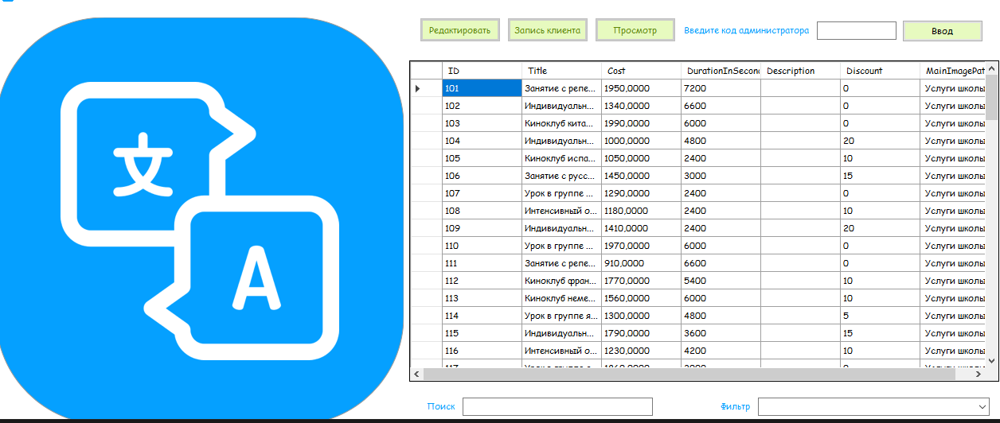

# Школа иностранных яыков "Learn"

Школа языков “Learn” открывает большое количество дополнительных направлений в рамках оказаний услуг
(например: подготовка к ЕГЭ, тренировки к TOEFL, выездные кемпинги в другие страны и много другое). 
В связи с этим нам важно, чтобы родители слушателей, а также наши взрослые слушатели могли ознакомиться со списком абсолютно всех услуг на наших компьютерах,
пока они ждут преподавателя на очередное занятие

### Необходимые условия

Для установки программного обеспечения, необходимо перейти на официальный сайт школы иностранных языков "Learn"
Выбрать пункт "скачать приложние"

### Установка
После скачивания , запустить установщик и следовать инструкция установщика
После установки можете использовать приложение

## Начало работы

У Вас в приложение на главном экране будет список всех занятий

## Авторы

* **Садовников Кирилл** - *Initial work* - [21ip213](http://stud.scc/~21ip213)
